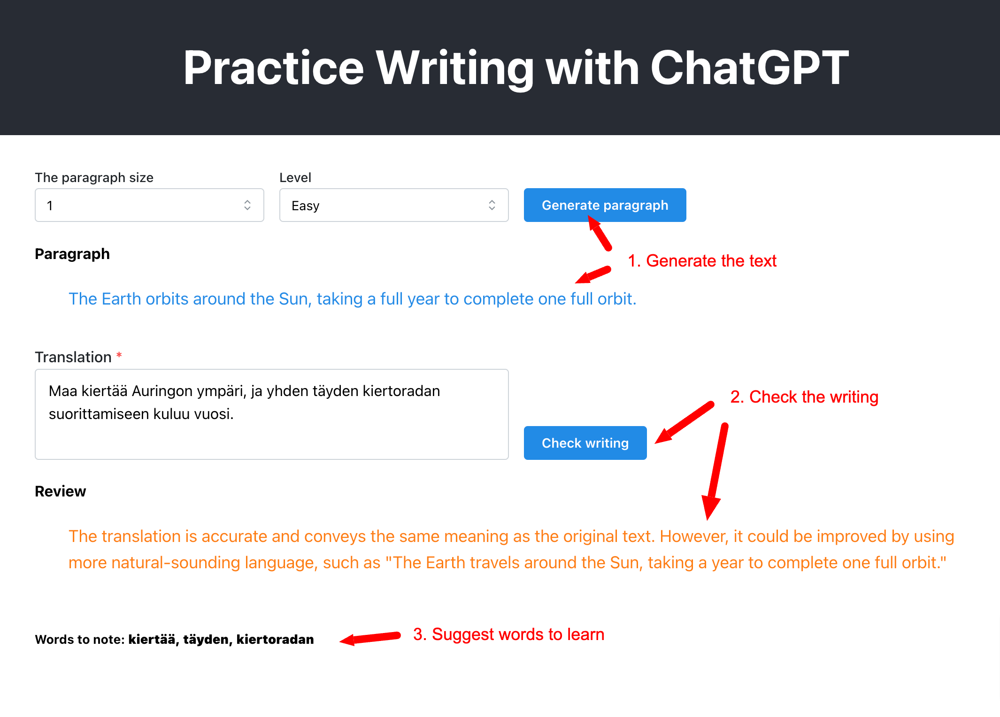

# Develop an app with ChatGPT

I think writing is the best method to learn a new language. I usually want to have a place where I can find the short paragraphs with random topics to practice writing and have a person to review my writing. Though, it is not easy in practice to achieve those, unless you go to a dedicated writing class. But thanks to ChatGPT and OpenAI, they provided an amazing technology so we can do all this for free (not really but extremely small fee). So this article is going to show how to develop a Web application with ChatGPT or OpenAI Api. The app uses React and OpenAI API for Javascript for simplicity and more in the purpose to show how to interact with ChatGPT to develop meaningful applications with AI-capabilities. The article assumes that you already knew about React and Web development, and all trivial tasks are not mentioned.

## About the App

Our app would be simple. There is only one page and the user is asked to input the paragraph length (number of sentences) and the difficulty level (easy, medium and hard) and select to generate a paragraph to practice writing. After writing is done, users can select to check if the writing is correct and where is wrong or what is the correct writing.

### Get started and setup the app

To get started, first create a new React app, there is no limitation on which tool to create the React app, but for quick and simplicity, `create-react-app` is proven to be quite a popular tool to use. Use the following command to create new React app (required to have NodeJS installed first)

And also check it can be run

```
$ npx create-react-app myGptWriting
$ cd myGptWrting
$ npm start
```

If the app is generated and can be run, let's talk about the OpenAI API part.

## OpenAI API

OpenAI offers an API for paid subscriptions (free trial) to interact with the ChatGPT. Here are the main terms used in app and also in ChatGPT.

- **prompt** is like the query we use to query database, for example of an prompt _Translate this text to Finnish_ or _Calculate the result of this operation_ .etc...

- **completion** refer to the results sent back from ChatGPT. There are various completion types, like _TextCompletion_ or _ChatCompletion_ for replies like we do chat with chatGPT

- **model** ChatGPT is an AI model and it is trained for various purposes, and thus there are different models optimized for different case, for example models optimized for chat like _gpt-3.5-turbo_ or _gpt-4_ or _ada_, _davinci_ for text completions. Each comes with a pro and con and with differnt price when using the API, like one is faster but less accurate or one is most accurate but slower .etc...

- **temperature** A parameter used in the API query used to indicate the randomness of the prompt (value is from zero to 1). Zero means it is least random and we can expect the same result for the same input and 1 means it is very random.

- **token** Used in calculate the cost per query, it is like a word, i.e _Translate this text_ has 3 tokens

When making the OpenAI API, we will send in the _prompt_, together with the _model_ and _the user role_ (required in chat completion and it has 3 values: _system_, _assistant_ and _user_) and the API return back the _completion_ results. The result is an array but has only one item unless we specifiy more.

## The Paragraph Generation

Our first part is to create 2 selectors and a button that will generate the paragraph. It is a trivial step in React to add those components into the main page and all the UI frameworks can be used in this step, in this article it will use the Mantine UI framework for React.

So now, we have the handler for the button click, next we will make a query to OpenAI API to generate the paragraph that we need. Assuming the paragraph size and the difficulty level is stored as the state and ready to use as followed,

```js
const [size, setSize] = useState(1);
const [level, setLevel] = useState("medium");

// the paragraph to generate
const [paragraph, setParagraph] = useState("");
```

Then, need to install the OpenAI SDK package

```
$ npm install openai
```

Then import and configure the OpenAI client,

```js
import { Configuration, OpenAIApi } from "openai";

const configuration = new Configuration({
  apiKey: process.env.OPENAI_API_KEY || "YOUR-OPENAI-API-KEY",
});

const openai = new OpenAIApi(configuration);
```

In order to obtain the Api key, go to `https://platform.openai.com/docs/api-reference` and register the account and create a new API key. **Note** that it is a paid subscription but has the free trial. After obtaining the Api key, either use it directly in the code (just to demo, not recommended in production use) or put it via the environment variable.

So now, we are ready to use the API. At this moment, it seems that the model `gpt-3.5-turbo` has the cheapest price and also serve the purpose, so it is chosen for this app, thus we need to use the chat completion API query for this. Here is the snippet to make the API call.

```js
const response = await openai.createChatCompletion({
  model: "gpt-3.5-turbo",
  temperature: 1, // we want the text to be most randomized
  messages: [
    {
      role: "user",
      content: `Generate a paragraph (in English) in a random topic with maximum ${size} lines and at level ${level}`,
    },
  ],
});

setParagraph(response.data.choices[0].message.content);
```

In the first statement, we specified the chat completion call, we passed in the model and the array of _messages_. Each message comes with a _role_ and the _content_ (prompt). Especially, in this call, the `temperature` is set to 1 to indicate that we want the results to be fully randomized, we don't want the same paragraph returned everytime. Finally, we passed the results (`choices` - an array of completions but usually only 1 item returned)

The next question is how to make this kind of prompt. Open AI has a limited free online course on how to create these prompts at `https://www.deeplearning.ai/short-courses/chatgpt-prompt-engineering-for-developers/` where it explains how to make the prompts effectively so that the ChatGPT can best understand. There is now a new branch of subject called _prompt engineer_ :D

So that is, we made the first prompt or first interaction with ChatGPT. Wait for a while, we should get the result back and there the paragraph.

## The Review

In the first part, we interacted with ChatGPT to generate for us the paragraph. Now we want it to review our writing work and perhaps give some corrections. So now we need a text input component and a button to trigger the reivew. It is again trivial task in React and assume that the writing is stored in state and ready to use as followed

```js
// the writing work
const [writing, setWriting] = useState("");

// the reviews's text
const [review, setReview] = useState("");
```

Next is the handler when press on the button,

```js
const response = await openai.createChatCompletion({
  model: "gpt-3.5-turbo",
  temperature: 0,
  messages: [
    {
      role: "user",
      content: `Check and review the following writing which is translated from the original text:
        "${writing}"

        The original text: "${paragraph}".
        `,
    },
  ],
});
```

In this OpenAI call, the temperatur is set to zero since we want the result or the review to be consistent all the time. In this prompt, we injected our writing work and also the previous paragraph into the message. And that's it, that is how we can utilize the power of ChatGPT to create helpful applications. It is more in how we know to write the right prompt so that ChatGPT can work most effective. Of course, there are a lot of more to learn (see the course above) in various tasks for ChatGPT.

## To wrap up

The app in my opinion is very useful in everyday work to help me learning new language. Even though the technical part in the app is very simple but it demonstrates one point that how easy nowadays to create a smart and helpful applications for daily life by utilizing the ChatGPT. The creativity is endless.

Here is the source code for working app

https://github.com/pholeth/gpt-writing

And the screenshots of the working app


